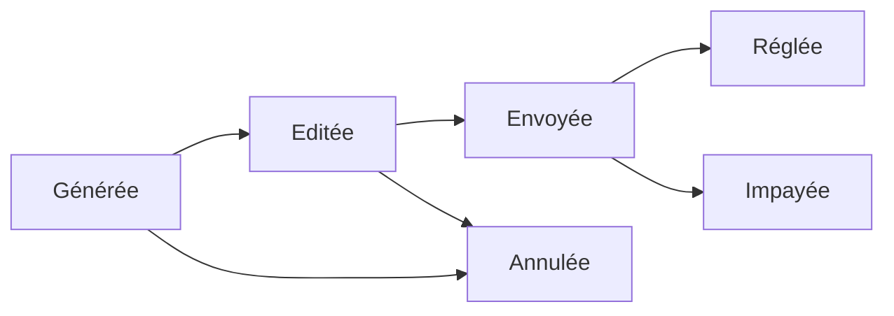

# WorkFlow Invoice

Projet démo du composant workflow Symfony

## Principe du projet

Illustrer le workflow du cycle de vie d'une facture

### Diagramme du workflow

## Composantes du projet

### Objet Invoice

 - updatedAt - Date
 - Date - Date
 - Total - Integer
 - client - String
 - Status - String -> receptacle du workflow

